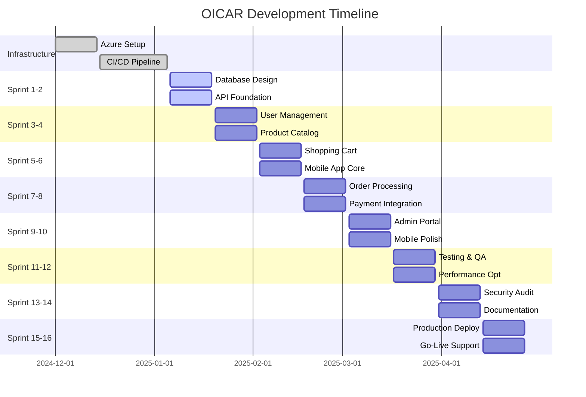

# OICAR Application Development Plan

Version: 1.0  
Date: December 2024  
Author: Development Team  
Status: Final

---

## Table of Contents

1. [Project Overview](#project-overview)
2. [Development Methodology](#development-methodology)
3. [Project Timeline](#project-timeline)
4. [Sprint Breakdown (2-Week Intervals)](#sprint-breakdown-2-week-intervals)
5. [Resource Allocation](#resource-allocation)
6. [Risk Management](#risk-management)
7. [Quality Assurance](#quality-assurance)
8. [Deployment Strategy](#deployment-strategy)

---

## Project Overview

### Project Scope
OICAR is a comprehensive e-commerce platform consisting of:
- Mobile Application: React Native cross-platform customer app
- Web Portal: ASP.NET administrative interface
- REST API: .NET 9.0 backend services
- Database: Azure SQL with Entity Framework
- Cloud Infrastructure: Microsoft Azure hosting

### Development Duration
- Total Project Duration: 16 weeks (8 sprints)
- Sprint Length: 2 weeks
- Team Size: 3-4 developers
- Start Date: January 2025
- Expected Completion: April 2025

---

## Development Methodology

### Agile Scrum Framework
- Sprint Planning: Every 2 weeks on Monday
- Daily Standups: 15-minute daily check-ins
- Sprint Reviews: Demo completed features
- Retrospectives: Process improvement sessions
- Backlog Grooming: Mid-sprint refinement

### Definition of Done
- Feature development completed  
- Unit tests written and passing  
- Integration tests implemented  
- Code reviewed by peers  
- Documentation updated  
- Deployed to staging environment  
- User acceptance testing passed  

---

## Project Timeline

---

## Sprint Breakdown (2-Week Intervals)

### Sprint 1-2: Foundation & Infrastructure
Dates: January 6-19, 2025  
Goal: Establish development foundation and core infrastructure

#### Week 1 (Jan 6-12)
Backend Team:
- Set up .NET 9.0 Web API project structure
- Configure Entity Framework Core with Azure SQL
- Implement basic authentication middleware
- Create initial database migrations
- Set up Swagger documentation

Mobile Team:
- Initialize React Native Expo project
- Set up project structure and navigation
- Configure TypeScript and ESLint
- Create basic component library
- Set up testing framework (Jest)

Infrastructure:
- Finalize Azure resource provisioning
- Configure GitHub Actions CI/CD pipeline
- Set up staging and production environments
- Implement automated deployment scripts

#### Week 2 (Jan 13-19)
Backend Team:
- Complete user authentication API endpoints
- Implement JWT token generation and validation
- Create base repository pattern
- Set up dependency injection container
- Write unit tests for authentication

Mobile Team:
- Implement basic authentication screens (Login/Register)
- Set up navigation structure
- Create reusable UI components
- Implement local storage for tokens
- Write unit tests for authentication components

Deliverables:
- Working authentication system (API + Mobile)
- CI/CD pipeline operational
- Azure infrastructure provisioned
- Basic project documentation

---

### **Sprint 3-4: User Management & Product Catalog**
**Dates**: January 20 - February 2, 2025  
**Goal**: Complete user management and implement product catalog functionality

#### **Week 3 (Jan 20-26)**
**Backend Team**:
- Implement user profile management APIs
- Create product catalog data models
- Build product CRUD operations
- Implement category management
- Add image upload functionality

**Mobile Team**:
- Build user profile screens
- Implement product browsing interface
- Create product search functionality
- Add image loading and caching
- Implement offline data storage

**Database**:
- Complete user profile tables
- Design product catalog schema
- Create product categories hierarchy
- Set up indexing for performance
- Implement data seeding scripts

#### **Week 4 (Jan 27 - Feb 2)**
**Backend Team**:
- Complete product catalog APIs
- Implement product filtering and sorting
- Add pagination for product listings
- Create product image management
- Write comprehensive API tests

**Mobile Team**:
- Complete product catalog screens
- Implement product detail views
- Add search and filter functionality
- Create product image galleries
- Implement pull-to-refresh and pagination

**Deliverables**:
- ✅ Complete user management system
- ✅ Product catalog with search and filtering
- ✅ Image upload and management
- ✅ Mobile product browsing experience

---

### **Sprint 5-6: Shopping Cart & Mobile Core Features**
**Dates**: February 3-16, 2025  
**Goal**: Implement shopping cart functionality and core mobile app features

#### **Week 5 (Feb 3-9)**
**Backend Team**:
- Design shopping cart data models
- Implement cart management APIs
- Create cart item CRUD operations
- Add cart persistence and session management
- Implement cart calculation logic

**Mobile Team**:
- Build shopping cart interface
- Implement add to cart functionality
- Create cart management screens
- Add quantity update and removal
- Implement cart persistence

#### **Week 6 (Feb 10-16)**
**Backend Team**:
- Complete cart APIs with validation
- Implement cart sharing and guest users
- Add cart expiration and cleanup
- Create cart analytics endpoints
- Write integration tests for cart functionality

**Mobile Team**:
- Complete cart user experience
- Add cart notifications and badges
- Implement cart synchronization
- Create smooth animations and transitions
- Add offline cart functionality

**Deliverables**:
- ✅ Fully functional shopping cart system
- ✅ Cart persistence and synchronization
- ✅ Mobile cart management interface
- ✅ Cart analytics and reporting

---

### **Sprint 7-8: Order Processing & Payment Integration**
**Dates**: February 17 - March 2, 2025  
**Goal**: Implement order processing workflow and payment integration

#### **Week 7 (Feb 17-23)**
**Backend Team**:
- Design order management data models
- Implement order creation and processing
- Create order status workflow
- Build order history and tracking
- Set up email notification system

**Mobile Team**:
- Build checkout process interface
- Implement order confirmation screens
- Create order history and tracking
- Add order management functionality
- Implement push notifications

#### **Week 8 (Feb 24 - Mar 2)**
**Backend Team**:
- Integrate Stripe payment gateway
- Implement payment processing workflow
- Add payment method management
- Create refund and cancellation logic
- Implement order fulfillment APIs

**Mobile Team**:
- Integrate payment processing
- Add payment method management
- Implement secure payment forms
- Create order confirmation flow
- Add order tracking features

**Deliverables**:
- ✅ Complete order processing system
- ✅ Payment gateway integration
- ✅ Order tracking and history
- ✅ Email and push notifications

---

### **Sprint 9-10: Admin Portal & Mobile Polish**
**Dates**: March 3-16, 2025  
**Goal**: Build administrative web portal and polish mobile app

#### **Week 9 (Mar 3-9)**
**Web Portal Team**:
- Set up ASP.NET Core MVC project
- Implement admin authentication
- Create product management interfaces
- Build order management dashboard
- Add user management functionality

**Mobile Team**:
- Polish user interface design
- Implement advanced search features
- Add product recommendations
- Create user preferences and settings
- Implement app performance optimizations

#### **Week 10 (Mar 10-16)**
**Web Portal Team**:
- Complete admin dashboard
- Add reporting and analytics
- Implement bulk operations
- Create inventory management
- Add system configuration options

**Mobile Team**:
- Implement accessibility features
- Add internationalization support
- Complete app store preparation
- Create onboarding experience
- Implement crash reporting

**Deliverables**:
- ✅ Complete administrative web portal
- ✅ Polished mobile app experience
- ✅ Reporting and analytics dashboard
- ✅ App store ready mobile application

---

### **Sprint 11-12: Testing & Performance Optimization**
**Dates**: March 17-30, 2025  
**Goal**: Comprehensive testing and performance optimization

#### **Week 11 (Mar 17-23)**
**QA Team**:
- Execute comprehensive test suite
- Perform load and stress testing
- Conduct security penetration testing
- Test cross-browser compatibility
- Validate mobile app performance

**Development Team**:
- Fix identified bugs and issues
- Optimize database queries
- Implement caching strategies
- Optimize mobile app performance
- Enhance error handling and logging

#### **Week 12 (Mar 24-30)**
**QA Team**:
- Complete user acceptance testing
- Validate accessibility compliance
- Test payment processing thoroughly
- Verify GDPR compliance features
- Conduct final security review

**Development Team**:
- Complete performance optimizations
- Implement monitoring and alerting
- Finalize error handling
- Complete code documentation
- Prepare production deployment

**Deliverables**:
- ✅ Comprehensive test coverage (>90%)
- ✅ Performance optimized applications
- ✅ Security audit passed
- ✅ Production-ready codebase

---

### **Sprint 13-14: Security Audit & Documentation**
**Dates**: March 31 - April 13, 2025  
**Goal**: Final security review and complete documentation

#### **Week 13 (Mar 31 - Apr 6)**
**Security Team**:
- Conduct thorough security audit
- Perform vulnerability assessment
- Review data protection compliance
- Test authentication and authorization
- Validate encryption implementations

**Documentation Team**:
- Complete technical documentation
- Create user manuals and guides
- Prepare deployment documentation
- Create troubleshooting guides
- Finalize API documentation

#### **Week 14 (Apr 7-13)**
**Security Team**:
- Address security findings
- Implement additional security measures
- Complete compliance verification
- Finalize security documentation
- Prepare security incident response plan

**Documentation Team**:
- Complete end-user documentation
- Create video tutorials
- Finalize operational procedures
- Complete training materials
- Prepare go-live documentation

**Deliverables**:
- ✅ Security audit certification
- ✅ Complete documentation suite
- ✅ Compliance verification
- ✅ Training materials ready

---

### **Sprint 15-16: Production Deployment & Go-Live**
**Dates**: April 14-27, 2025  
**Goal**: Production deployment and launch support

#### **Week 15 (Apr 14-20)**
**DevOps Team**:
- Execute production deployment
- Configure production monitoring
- Set up backup and disaster recovery
- Validate production environment
- Perform smoke testing

**Support Team**:
- Prepare customer support processes
- Train support staff
- Set up monitoring dashboards
- Prepare incident response procedures
- Create customer onboarding materials

#### **Week 16 (Apr 21-27)**
**All Teams**:
- Monitor production launch
- Provide go-live support
- Address any launch issues
- Collect user feedback
- Plan post-launch iterations

**Marketing Team**:
- Execute launch marketing campaign
- Monitor user adoption
- Collect initial user feedback
- Prepare user testimonials
- Plan future feature releases

**Deliverables**:
- ✅ Production system live and stable
- ✅ User onboarding and support active
- ✅ Monitoring and alerting operational
- ✅ Post-launch support plan executed

---

## 👥 Resource Allocation

### **Team Structure**

#### **Sprint 1-8: Core Development**
- **Backend Lead** (1.0 FTE): API development, database design
- **Mobile Lead** (1.0 FTE): React Native app development
- **Full-Stack Developer** (1.0 FTE): Web portal, API support
- **DevOps Engineer** (0.5 FTE): Infrastructure, CI/CD

#### **Sprint 9-12: Polish & Testing**
- **Backend Lead** (0.8 FTE): Performance optimization, bug fixes
- **Mobile Lead** (0.8 FTE): UI polish, performance tuning
- **QA Engineer** (1.0 FTE): Testing, quality assurance
- **Security Specialist** (0.5 FTE): Security audit, compliance

#### **Sprint 13-16: Launch Preparation**
- **Technical Writer** (1.0 FTE): Documentation, user guides
- **DevOps Engineer** (1.0 FTE): Production deployment
- **Support Specialist** (0.5 FTE): Customer support preparation
- **Project Manager** (0.5 FTE): Launch coordination

### **Budget Allocation**
| **Category** | **Percentage** | **Estimated Cost** |
|--------------|----------------|-------------------|
| Development | 60% | $120,000 |
| Infrastructure | 15% | $30,000 |
| Testing & QA | 10% | $20,000 |
| Documentation | 8% | $16,000 |
| Security Audit | 4% | $8,000 |
| Project Management | 3% | $6,000 |
| **Total** | **100%** | **$200,000** |

---

## ⚠️ Risk Management

### **High-Priority Risks**

#### **Technical Risks**
1. **Third-Party Integration Delays**
   - **Risk**: Payment gateway or Azure service issues
   - **Mitigation**: Early integration testing, backup providers
   - **Impact**: Medium | Probability: Low

2. **Performance Bottlenecks**
   - **Risk**: App performance issues under load
   - **Mitigation**: Early performance testing, optimization sprints
   - **Impact**: High | Probability: Medium

3. **Mobile Platform Changes**
   - **Risk**: iOS/Android updates breaking compatibility
   - **Mitigation**: Regular platform updates, beta testing
   - **Impact**: Medium | Probability: Low

#### **Schedule Risks**
1. **Feature Scope Creep**
   - **Risk**: Uncontrolled feature additions
   - **Mitigation**: Strict change control process
   - **Impact**: High | Probability: Medium

2. **Resource Availability**
   - **Risk**: Key team members unavailable
   - **Mitigation**: Cross-training, documentation
   - **Impact**: High | Probability: Low

### **Risk Monitoring**
- **Weekly Risk Reviews**: Every sprint planning
- **Escalation Process**: Project Manager → Stakeholders
- **Contingency Planning**: 15% schedule buffer built in

---

## 🧪 Quality Assurance

### **Testing Strategy**

#### **Automated Testing**
- **Unit Tests**: >90% code coverage requirement
- **Integration Tests**: API and database integration
- **End-to-End Tests**: Critical user journeys
- **Performance Tests**: Load testing with 1000+ users
- **Security Tests**: Automated vulnerability scanning

#### **Manual Testing**
- **User Acceptance Testing**: Business stakeholder validation
- **Device Testing**: iOS/Android device compatibility
- **Browser Testing**: Cross-browser web portal validation
- **Accessibility Testing**: WCAG 2.1 AA compliance
- **Usability Testing**: User experience validation

### **Quality Gates**
- **Sprint Completion**: All acceptance criteria met
- **Code Review**: Peer review required for all changes
- **Security Review**: Security checklist completed
- **Performance**: Response time targets met
- **Accessibility**: Accessibility audit passed

---

## 🚀 Deployment Strategy

### **Environment Progression**

#### **Development Environment**
- **Purpose**: Active development and unit testing
- **Deployment**: Automatic on code commit
- **Data**: Synthetic test data
- **Access**: Development team only

#### **Staging Environment**
- **Purpose**: Integration testing and user acceptance
- **Deployment**: Manual promotion from development
- **Data**: Production-like test data
- **Access**: QA team and stakeholders

#### **Production Environment**
- **Purpose**: Live customer-facing system
- **Deployment**: Manual promotion with approval
- **Data**: Live customer data
- **Access**: End users and support team

### **Deployment Process**
1. **Code Freeze**: 48 hours before deployment
2. **Smoke Testing**: Automated verification in staging
3. **Stakeholder Approval**: Business sign-off required
4. **Production Deployment**: Blue-green deployment strategy
5. **Post-Deployment Monitoring**: 24-hour watch period

### **Rollback Strategy**
- **Database**: Point-in-time restore capability
- **Application**: Previous version deployment ready
- **Monitoring**: Automated health checks and alerts
- **Communication**: Stakeholder notification process

---

## 📈 Success Metrics

### **Development Metrics**
- **Velocity**: Story points completed per sprint
- **Quality**: Bug rate and resolution time
- **Coverage**: Automated test coverage percentage
- **Performance**: Response time and load capacity

### **Business Metrics**
- **Time to Market**: Launch date achievement
- **User Adoption**: Registration and usage metrics
- **Performance**: System availability and response time
- **Customer Satisfaction**: User feedback and ratings

### **Project Health Indicators**
- **Green**: On track for all deliverables
- **Yellow**: Minor delays or issues identified
- **Red**: Significant risks or delays require action

---

## 📋 Dependencies & Prerequisites

### **External Dependencies**
- **Azure Services**: Account setup and resource provisioning
- **Payment Gateway**: Stripe account and API access
- **Email Service**: SendGrid account configuration
- **App Stores**: Apple and Google developer accounts

### **Internal Prerequisites**
- **Development Team**: Recruitment and onboarding complete
- **Hardware**: Development machines and mobile devices
- **Software Licenses**: Development tools and services
- **Network Access**: VPN and Azure connectivity

---

*Development Plan Version: 1.0*  
*Last Updated: December 2024*  
*Next Review: Monthly project status meetings* 