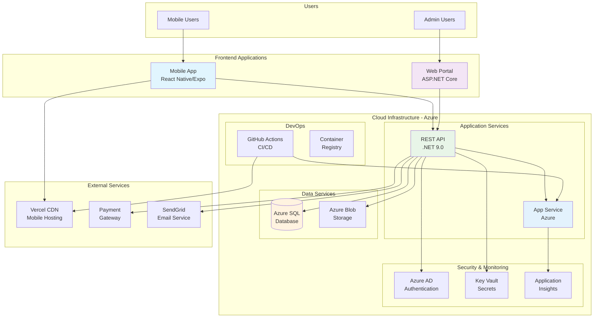
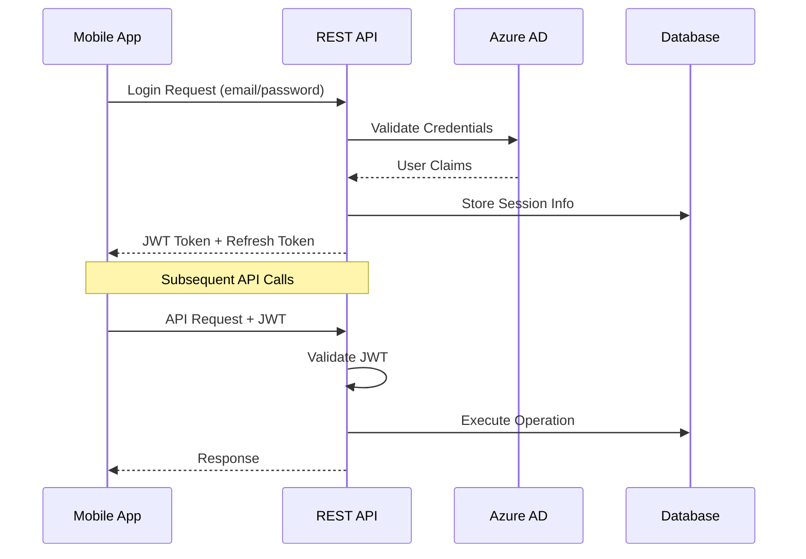

# 🏗️ OICAR Architecture Overview

**Version**: 1.0  
**Date**: December 2024  
**Author**: Development Team  
**Status**: Final

---

## 📖 Table of Contents

1. [System Overview](#system-overview)
2. [Architecture Diagram](#architecture-diagram)
3. [Frontend Applications](#frontend-applications)
4. [Backend Services](#backend-services)
5. [Database Layer](#database-layer)
6. [Cloud Infrastructure](#cloud-infrastructure)
7. [Security Architecture](#security-architecture)
8. [Integration Patterns](#integration-patterns)
9. [Deployment Architecture](#deployment-architecture)
10. [Performance & Scalability](#performance--scalability)

---

## 🎯 System Overview

### **Architecture Style**
OICAR follows a **modern three-tier architecture** with cloud-native deployment:

- **Presentation Tier**: React Native mobile app + ASP.NET web portal
- **Application Tier**: .NET 9.0 REST API with business logic
- **Data Tier**: Azure SQL Database with Entity Framework

### **Design Principles**
- **Mobile-First**: Primary focus on React Native mobile experience
- **API-Centric**: RESTful API serves both mobile and web applications
- **Cloud-Native**: Azure-hosted with auto-scaling capabilities
- **Security by Design**: GDPR-compliant with enterprise-grade security
- **DevOps Integration**: Automated CI/CD pipelines

---

## 📊 Architecture Diagram



---

## 📱 Frontend Applications

### **1. Mobile Application (Primary)**
**Technology Stack**:
- **Framework**: React Native with Expo
- **Language**: TypeScript
- **State Management**: React Hooks + Context API
- **Navigation**: React Navigation v6
- **HTTP Client**: Axios
- **Testing**: Jest + React Native Testing Library

**Key Features**:
- Cross-platform (iOS/Android) from single codebase
- Native performance with JavaScript bridge
- Over-the-air updates via Expo
- Push notifications
- Offline-first cart management

**Deployment**:
- **Development**: Expo Go app
- **Production**: Vercel hosting for web builds
- **Native**: App Store & Google Play Store

### **2. Web Portal (Administrative)**
**Technology Stack**:
- **Framework**: ASP.NET Core 9.0 MVC
- **Language**: C#
- **Frontend**: Razor Pages + Bootstrap 5
- **Authentication**: ASP.NET Identity
- **Real-time**: SignalR
- **Testing**: xUnit + Playwright

**Key Features**:
- Server-side rendering for SEO
- Role-based access control
- Real-time order notifications
- Responsive design
- Data export capabilities

**Deployment**:
- **Production**: Azure App Service
- **Database**: Entity Framework migrations
- **Monitoring**: Application Insights

---

## 🛠️ Backend Services

### **REST API Architecture**
**Technology Stack**:
- **Framework**: .NET 9.0 Web API
- **Language**: C#
- **ORM**: Entity Framework Core 9.0
- **Authentication**: JWT Bearer tokens
- **Documentation**: Swagger/OpenAPI 3.0
- **Testing**: xUnit + WebApplicationFactory

**API Design Principles**:
- **RESTful**: Standard HTTP verbs and status codes
- **Versioning**: URL-based versioning (v1, v2)
- **Pagination**: Cursor-based for large datasets
- **Filtering**: OData-style query parameters
- **Rate Limiting**: Per-client throttling

### **Core Services**

#### **1. Product Service**
```csharp
// Product management operations
GET    /api/v1/products
POST   /api/v1/products
PUT    /api/v1/products/{id}
DELETE /api/v1/products/{id}
GET    /api/v1/products/categories
```

#### **2. Order Service**
```csharp
// Order lifecycle management
GET    /api/v1/orders
POST   /api/v1/orders
GET    /api/v1/orders/{id}
PUT    /api/v1/orders/{id}/status
DELETE /api/v1/orders/{id}
```

#### **3. User Service**
```csharp
// User account management
POST   /api/v1/auth/register
POST   /api/v1/auth/login
POST   /api/v1/auth/refresh
GET    /api/v1/users/profile
PUT    /api/v1/users/profile
DELETE /api/v1/users/account
```

#### **4. Cart Service**
```csharp
// Shopping cart operations
GET    /api/v1/cart
POST   /api/v1/cart/items
PUT    /api/v1/cart/items/{id}
DELETE /api/v1/cart/items/{id}
POST   /api/v1/cart/checkout
```

### **Business Logic Layer**
- **Domain Models**: Rich domain objects with business rules
- **Services**: Application services orchestrating operations
- **Validators**: FluentValidation for input validation
- **Mappings**: AutoMapper for DTO transformations
- **Event Handling**: MediatR for CQRS patterns

---

## 💾 Database Layer

### **Azure SQL Database**
**Configuration**:
- **Tier**: Standard S2 (50 DTU)
- **Storage**: 250 GB with auto-growth
- **Backup**: Automated daily backups with 7-day retention
- **Security**: TDE encryption, firewall rules, VNet integration

### **Entity Framework Core**
**Features**:
- **Code-First**: Migrations for schema versioning
- **Conventions**: Standard naming conventions
- **Relationships**: Configured via Fluent API
- **Performance**: Query optimization, connection pooling
- **Auditing**: Created/Modified timestamps

### **Database Schema**

#### **Core Tables**
```sql
-- Users and authentication
Users (Id, Email, PasswordHash, CreatedAt, IsActive)
UserProfiles (UserId, FirstName, LastName, Phone, UpdatedAt)
UserAddresses (Id, UserId, AddressLine1, City, PostalCode, IsDefault)

-- Product catalog
Categories (Id, Name, Description, ParentId, IsActive)
Products (Id, Name, Description, Price, CategoryId, StockQuantity, IsActive)
ProductImages (Id, ProductId, ImageUrl, IsMain, SortOrder)

-- Shopping and orders
ShoppingCarts (Id, UserId, CreatedAt, UpdatedAt)
CartItems (Id, CartId, ProductId, Quantity, Price)
Orders (Id, UserId, OrderDate, Status, TotalAmount, ShippingAddress)
OrderItems (Id, OrderId, ProductId, Quantity, UnitPrice, LineTotal)

-- System tables
AuditLogs (Id, EntityName, Action, UserId, Timestamp, Changes)
```

#### **Relationships**
- **One-to-Many**: Category → Products, User → Orders
- **Many-to-Many**: Orders ↔ Products (via OrderItems)
- **One-to-One**: User → UserProfile
- **Self-Referencing**: Category → ParentCategory

---

## ☁️ Cloud Infrastructure

### **Microsoft Azure Services**

#### **Compute Services**
- **Azure App Service**: API hosting with auto-scaling
- **App Service Plan**: Standard S1 with 1.75 GB RAM
- **Deployment Slots**: Staging and production environments

#### **Data Services**
- **Azure SQL Database**: Primary relational database
- **Azure Blob Storage**: Static files and images
- **Azure Redis Cache**: Session and application caching

#### **Security Services**
- **Azure Active Directory**: Identity and access management
- **Azure Key Vault**: Secrets and certificate management
- **Azure Security Center**: Threat protection and monitoring

#### **Monitoring Services**
- **Application Insights**: Performance and error tracking
- **Azure Monitor**: Infrastructure monitoring
- **Log Analytics**: Centralized logging

### **Resource Groups**
```
oicar-production-rg/
├── oicar-api-app-service
├── oicar-database-sql
├── oicar-storage-account
├── oicar-keyvault
├── oicar-redis-cache
└── oicar-app-insights
```

---

## 🔐 Security Architecture

### **Authentication Flow**


### **Security Layers**

#### **1. Transport Security**
- **TLS 1.3**: All communication encrypted in transit
- **HSTS**: HTTP Strict Transport Security headers
- **Certificate Pinning**: Mobile app validates API certificates

#### **2. Authentication & Authorization**
- **JWT Tokens**: Stateless authentication with 1-hour expiration
- **Refresh Tokens**: Secure token renewal (30-day expiration)
- **Role-Based Access**: Customer, Admin, and System roles
- **Multi-Factor Auth**: Required for admin accounts

#### **3. Application Security**
- **Input Validation**: FluentValidation for all inputs
- **SQL Injection**: Entity Framework parameterized queries
- **XSS Protection**: Content Security Policy headers
- **CSRF Protection**: Anti-forgery tokens

#### **4. Data Protection**
- **Encryption at Rest**: AES-256 for database and storage
- **Personal Data**: GDPR-compliant handling and retention
- **PCI Compliance**: Tokenized payment data storage
- **Audit Logging**: All data access tracked

---

## 🔄 Integration Patterns

### **API Integration**
- **RESTful Design**: Standard HTTP methods and status codes
- **Content Negotiation**: JSON primary, XML support
- **Versioning**: URL-based versioning strategy
- **Rate Limiting**: Redis-based throttling

### **External Service Integration**

#### **Payment Gateway**
```csharp
// Stripe integration pattern
public async Task<PaymentResult> ProcessPaymentAsync(PaymentRequest request)
{
    var options = new PaymentIntentCreateOptions
    {
        Amount = request.Amount,
        Currency = "usd",
        PaymentMethodTypes = new List<string> { "card" }
    };
    
    var service = new PaymentIntentService();
    var paymentIntent = await service.CreateAsync(options);
    
    return new PaymentResult
    {
        Success = paymentIntent.Status == "succeeded",
        TransactionId = paymentIntent.Id
    };
}
```

#### **Email Service**
```csharp
// SendGrid integration
public async Task SendOrderConfirmationAsync(Order order)
{
    var client = new SendGridClient(apiKey);
    var msg = MailHelper.CreateSingleEmail(
        from: new EmailAddress("orders@oicar.com"),
        to: new EmailAddress(order.User.Email),
        subject: $"Order Confirmation #{order.Id}",
        plainTextContent: GenerateOrderText(order),
        htmlContent: GenerateOrderHtml(order)
    );
    
    await client.SendEmailAsync(msg);
}
```

### **Real-time Communication**
- **SignalR**: Real-time order updates for admin portal
- **Push Notifications**: Expo notifications for mobile app
- **WebHooks**: Payment gateway status updates

---

## 🚀 Deployment Architecture

### **CI/CD Pipeline**

#### **GitHub Actions Workflow**
```yaml
name: OICAR Deployment Pipeline

on:
  push:
    branches: [main]
  pull_request:
    branches: [main]

jobs:
  test:
    runs-on: ubuntu-latest
    steps:
      - uses: actions/checkout@v3
      - name: Setup .NET
        uses: actions/setup-dotnet@v3
        with:
          dotnet-version: '9.0.x'
      - name: Run API Tests
        run: dotnet test SnjofkaloAPI.Tests/
      - name: Run Mobile Tests
        run: |
          cd OICAR-MobileApp
          npm install
          npm test

  deploy:
    needs: test
    runs-on: ubuntu-latest
    if: github.ref == 'refs/heads/main'
    steps:
      - name: Deploy to Azure
        uses: azure/webapps-deploy@v2
        with:
          app-name: 'oicar-api'
          publish-profile: ${{ secrets.AZURE_WEBAPP_PUBLISH_PROFILE }}
      
      - name: Deploy Mobile to Vercel
        uses: amondnet/vercel-action@v20
        with:
          vercel-token: ${{ secrets.VERCEL_TOKEN }}
          vercel-project-id: ${{ secrets.VERCEL_PROJECT_ID }}
```

### **Environment Configuration**

#### **Development Environment**
- **API**: Local IIS Express
- **Database**: LocalDB or SQL Server Developer
- **Mobile**: Expo Development Build
- **Storage**: Local file system

#### **Staging Environment**
- **API**: Azure App Service (staging slot)
- **Database**: Azure SQL (separate staging database)
- **Mobile**: Expo Preview
- **Storage**: Azure Blob Storage (staging container)

#### **Production Environment**
- **API**: Azure App Service (production slot)
- **Database**: Azure SQL (production database)
- **Mobile**: Vercel CDN + App Stores
- **Storage**: Azure Blob Storage (production container)

---

## ⚡ Performance & Scalability

### **Performance Optimization**

#### **API Performance**
- **Caching**: Redis for frequently accessed data
- **Connection Pooling**: Entity Framework connection optimization
- **Async Operations**: Non-blocking I/O operations
- **Query Optimization**: Efficient LINQ queries with minimal N+1 issues

#### **Mobile Performance**
- **Bundle Splitting**: Code splitting for faster initial load
- **Image Optimization**: WebP format with lazy loading
- **Offline Support**: Local storage for cart and user data
- **Memory Management**: Proper component lifecycle management

#### **Database Performance**
- **Indexing**: Optimized indexes on frequently queried columns
- **Query Plans**: Regular query performance analysis
- **Partitioning**: Table partitioning for large datasets
- **Archiving**: Automated old data archival

### **Scalability Strategy**

#### **Horizontal Scaling**
- **API**: Auto-scaling Azure App Service instances
- **Database**: Read replicas for read-heavy operations
- **Storage**: CDN distribution for static content
- **Caching**: Redis cluster for distributed caching

#### **Vertical Scaling**
- **Compute**: Easy scaling of App Service tiers
- **Database**: DTU/vCore scaling based on demand
- **Storage**: Automatic blob storage scaling
- **Memory**: Application-level memory optimization

### **Performance Targets**
| **Metric** | **Target** | **Current** |
|------------|------------|-------------|
| API Response Time | < 200ms | ~150ms |
| Mobile App Launch | < 3s | ~2.5s |
| Database Query | < 100ms | ~75ms |
| Page Load Time | < 2s | ~1.8s |
| Concurrent Users | 1000+ | Tested to 500 |

---

## 📈 Monitoring & Analytics

### **Application Monitoring**
- **Health Checks**: Automated endpoint monitoring
- **Performance Metrics**: Response times, throughput, error rates
- **Dependency Tracking**: External service performance
- **Custom Telemetry**: Business-specific metrics

### **Error Tracking**
- **Exception Logging**: Structured logging with correlation IDs
- **Error Alerting**: Real-time notifications for critical errors
- **Performance Degradation**: Alerts for response time increases
- **Availability Monitoring**: Uptime tracking and SLA monitoring

---

## 🔮 Future Architecture Considerations

### **Planned Enhancements**
- **Microservices**: Breaking monolithic API into domain services
- **Event Sourcing**: Event-driven architecture for order processing
- **API Gateway**: Centralized API management and routing
- **Container Orchestration**: Kubernetes for container management
- **Machine Learning**: Recommendation engine integration

### **Technology Evolution**
- **.NET Updates**: Staying current with latest .NET releases
- **React Native**: Upgrading to latest RN versions
- **Azure Services**: Adopting new Azure capabilities
- **Security Standards**: Implementing emerging security practices

---

*Architecture Version: 1.0*  
*Last Updated: December 2024*  
*Next Review: Q2 2025* 